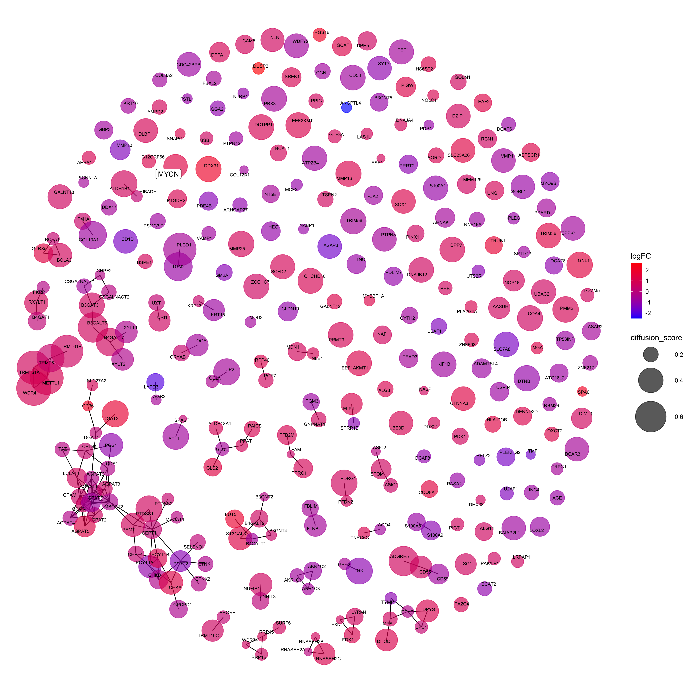
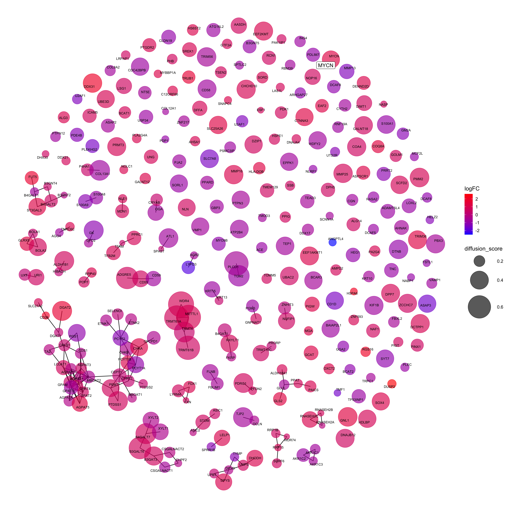

noderank maps differential gene expression results onto an established network 
of protein-protein associations and employs network analysis methods to select 
a prioritized list of important nodes. For data in which the mechanism of 
perturbation is known, each ranked list result is scored by the position of 
the causal gene. 

```{r, include = FALSE}
knitr::opts_chunk$set(
  collapse = TRUE,
  comment = "#>"
)
```

```{r setup}
library(ggplot2)
library(ggnetwork)
library(knitr)
library(kableExtra)

devtools::load_all('..')

set.seed(4)

```

#### Import DEA Data and Define Parameters

```{r}

# read differential expression data (annotated with gene symbols)
de_string <- readRDS('../data/de_string_v11.RDS')

# select MYC condition as an example
myc_de <- de_string$MYC

# define globals
deg <- myc_de
edge_conf_score_min <- 950
logFC_min <- 1.5
pvalue_max <- 0.05
causal_gene_symbol <- 'MYC'
final_results <- c()
export_network <- FALSE
n_sim <- 9999
method <- 'raw'
sim_method = 'jaccard'
min_diff_score <- 0.15
weighted = TRUE

```

#### Generate Protein Association Network and Prune by DEA Results

```{r}
# network generation ------------------------------------------------------

# generate protein association network
string_db <- STRINGdb::STRINGdb$new(version="11",
                                    species=9606,
                                    score_threshold=edge_conf_score_min)
ppi <- string_db$get_graph()

# filter to only include genes that are also in the DEG results - check this
ppi2 <- attribute_filter(ppi, name %in% deg$STRING_id)

# map DEA results onto ppi network
ppi_painted <- df_to_vert_attr(graph=ppi2, df=deg, common="STRING_id",
                               attr_name = c("Symbol", "ID", "logFC", "AveExpr",
                                             "t", "P.Value", "adj.P.Val", "B"))

# seed the graph based on the fold-change and pvalue thresholds
ppi_painted_filt <- attribute_seed(ppi_painted,
                                     abs(logFC) > log2(logFC_min) & adj.P.Val < pvalue_max)

# select the connected subgraph
ppi_painted_filt_giant <- connected_subgraph(ppi_painted_filt)

# calculate diffusion scores
ppi_painted_filt_giant <- calc_diffusion(graph = ppi_painted_filt_giant,
                                         method = method)

# filter network to only include scores above threshold
final_network <- attribute_filter(ppi_painted_filt_giant,
                                  diffusion_score > min_diff_score)
# remove duplicated edges
final_network_simple <- igraph::simplify(final_network)

# View(igraph::as_data_frame(ppi_painted_filt_giant, what = 'vertices'))
# MYC is filtered out because of low diffusion score
# View(igraph::as_data_frame(final_network_simple, what = 'vertices'))


```

#### Score the network by structural similarity to the causal gene, MYC

```{r}
# network scoring ---------------------------------------------------------

# generate network scores
scoring_output <- structural_sim(network = final_network_simple,
                                 string_db = string_db,
                                 ppi = ppi,
                                 method = 'diffusion_score',
                                 sim_method = sim_method,
                                 causal_gene_symbol = causal_gene_symbol,
                                 weighted = weighted)

# evaluate scoring
performance_results <- evaluate_performance(network = scoring_output$network,
                                            network_df = scoring_output$network_df,
                                            causal_sim = scoring_output$causal_sim,
                                            method = 'diffusion_score',
                                            n_sim = n_sim,
                                            weighted = weighted)

```

#### Inspect Results

```{r, out.width="100%"}

# plotting 
plot1 <- plot_graph(scoring_output$network, method = 'diffusion_score', gene_list = c('MYCN'))

ggsave(plot = plot1, filename = 'pfigure1.png', width = 15, height = 15)


knitr::kable(head(scoring_output$network_df)) %>% 
  kableExtra::kable_styling(latex_options="scale_down")

knitr::kable(performance_results) %>% 
  kableExtra::kable_styling(latex_options="scale_down") 
```

### Pipeline Workflow

The workflow above can also be implemented in one step by calling the centrality_pipeline() wrapper function: 

```{r, out.width='100%'}

# call wrapper
results <- propagation_pipeline(deg = myc_de,
                            edge_conf_score_min = 950,
                            logFC_min = 1.5,
                            pvalue_max = 0.05,
                            method = 'raw',
                            min_diff_score = 0.15,
                            causal_gene_symbol = 'MYC',
                            export_network = FALSE,
                            sim_method = 'jaccard',
                            n_sim = 9999,
                            weighted = TRUE)

names(results)

# plot output
set.seed(4)
plot2 <- plot_graph(results$network, method = 'diffusion_score', gene_list = c('MYCN'))

ggsave(plot = plot2, filename = 'pfigure2.png', width = 15, height = 15)


knitr::kable(head(results$top_genes)) %>% 
  kableExtra::kable_styling(latex_options="scale_down")

knitr::kable(results$performance) %>% 
  kableExtra::kable_styling(latex_options="scale_down")


```


