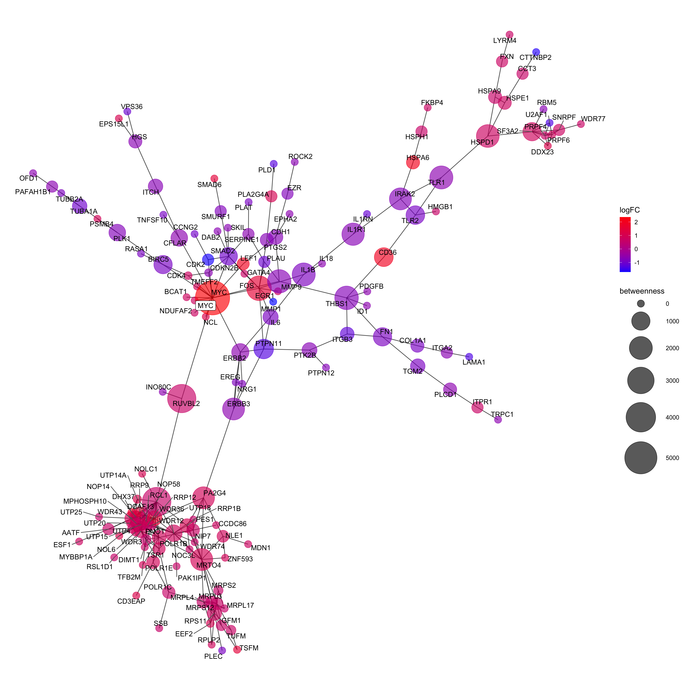
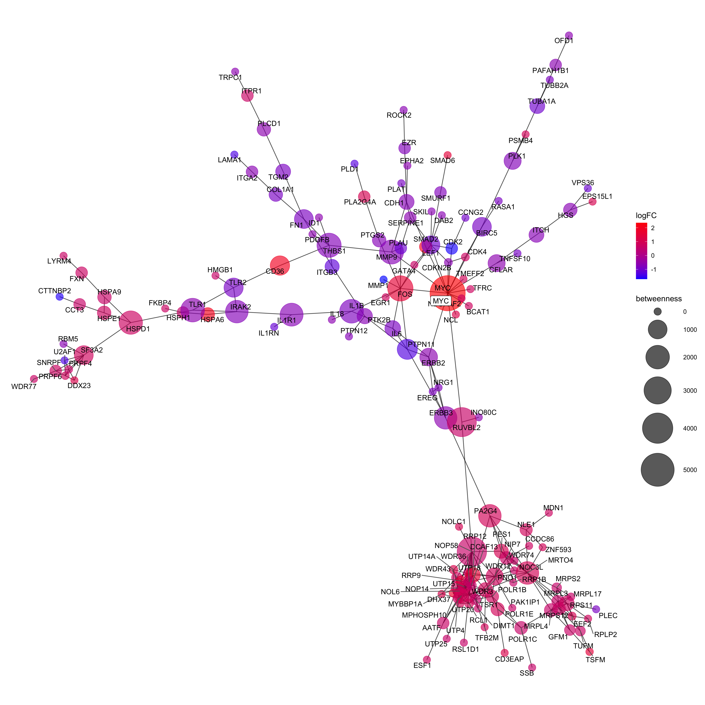

noderank maps differential gene expression results onto an established network 
of protein-protein associations and employs network analysis methods to select 
a prioritized list of important nodes. For data in which the mechanism of 
perturbation is known, each ranked list result is scored by the position of 
the causal gene. 

```{r, include = FALSE}
knitr::opts_chunk$set(
  collapse = TRUE,
  comment = "#>"
)
```

```{r setup}
library(noderank)
library(ggplot2)
library(ggnetwork)
library(knitr)
library(kableExtra)

devtools::load_all('..')

set.seed(4)

```

#### Import DEA Data and Define Parameters

```{r}

# read differential expression data (annotated with gene symbols)
de_string <- readRDS('../data/de_string.RDS')

# select MYC condition as an example
myc_de <- de_string$MYC

# define globals
deg <- myc_de
edge_conf_score_min <- 950
logFC_min <- 1.5
pvalue_max <- 0.05
causal_gene_symbol <- 'MYC'
method <- 'betweenness'
final_results <- c()
export_network <- FALSE
n_sim <- 9999

```

#### Generate Protein Association Network and Prune by DEA Results

```{r}
# network generation ------------------------------------------------------

# generate protein association network
string_db <- STRINGdb::STRINGdb$new(version="10",
                                    species=9606,
                                    score_threshold=edge_conf_score_min)
ppi <- string_db$get_graph()

# map DEA results onto ppi network
ppi_painted <- df_to_vert_attr(graph=ppi, df=deg, common="STRING_id",
                               attr_name = c("Symbol", "ID", "logFC", "AveExpr",
                                             "t", "P.Value", "adj.P.Val", "B"))

# subset the graph to only include nodes that meet thresholds
ppi_painted_filt <- attribute_filter(ppi_painted,
                                     abs(logFC) > log2(logFC_min) & adj.P.Val < pvalue_max)

# select the connected subgraph
ppi_painted_filt_giant <- connected_subgraph(ppi_painted_filt)

# calculate centrality
ppi_painted_filt_giant <- calc_centrality(ppi_painted_filt_giant, method = method, bt=T, len = -1)

# write final graph
# igraph::write_graph(ppi_painted_filt_giant,
#                     file=glue::glue("data/MYC_DE_network_example_{edge_conf_score_min}.graphml"),
#                     format = "graphml")

# dataframe of final graph results
network_df <- igraph::as_data_frame(ppi_painted_filt_giant, what = 'vertices')
network_df <- dplyr::arrange(network_df, -betweenness)
rownames(network_df) <- NULL


```

#### Score the network by structural similarity to the causal gene, MYC

```{r}
# network scoring ---------------------------------------------------------

# find the STRING ID for the causal gene
xref <- data.frame(symbol = causal_gene_symbol)
xref <- string_db$map(xref, "symbol", removeUnmappedRows=T, quiet=T)

# calculate similarity of each node and slice out the causal gene
sim <- igraph::similarity(ppi)
index <- which(igraph::V(ppi)$name == xref$STRING_id)
causal_sim <- sim[index,]

# make scores a named vector
names(causal_sim) <- igraph::V(ppi)$name

# get the scores associated with the subnetwork
pred_scores <- causal_sim[igraph::V(ppi_painted_filt_giant)$name]
mean_pred_score <- mean(pred_scores)

# estimate uncertainty with a random draw of the full ppi graph
n_sim <- 9999
n_draws <- length(igraph::V(ppi_painted_filt_giant)) #151
samples <- lapply(1:n_sim, function(x) sample(causal_sim, n_draws))
sample_means <- sapply(samples, mean)

# calculate p
score_pval <- sum(sample_means > mean_pred_score) / n_sim

```

#### Inspect Results

```{r, out.width="100%"}

# results 
network <- ppi_painted_filt_giant
ggn <- ggnetwork(network)

plot1 <- ggplot(ggn, aes(x = x, y = y, xend = xend, yend = yend)) +
    geom_edges(alpha = 0.7) + 
    geom_nodes(aes(color = logFC, size = betweenness), alpha = 0.65) +
    geom_nodetext_repel(aes(label = Symbol)) + 
    geom_nodelabel_repel(data=subset(ggn, Symbol == 'MYC'), aes(label=Symbol)) +
    scale_color_gradient(low = 'blue', high = 'red') +
    scale_size_continuous(range = c(5, 25)) + 
    theme_blank()

ggsave(plot = plot1, filename = 'figure1.png', width = 15, height = 15)


knitr::kable(head(network_df)) %>% 
  kableExtra::kable_styling(latex_options="scale_down")

d <- data.frame(mean_score = mean_pred_score, 
                pvalue = score_pval)
knitr::kable(d) 
```

### Pipeline Workflow

The workflow above can also be implemented in one step by calling the network_pipeline() wrapper function: 

```{r, out.width='100%'}

results <- network_pipeline(deg = myc_de,
                            edge_conf_score_min = 950,
                            logFC_min = 1.5,
                            pvalue_max = 0.05,
                            method = 'betweenness',
                            causal_gene_symbol = 'MYC',
                            export_network = FALSE,
                            n_sim = 9999)

names(results)

# results 
network <- results$network
ggn <- ggnetwork(network)

plot2 <- ggplot(ggn, aes(x = x, y = y, xend = xend, yend = yend)) +
    geom_edges(alpha = 0.7) + 
    geom_nodes(aes(color = logFC, size = betweenness), alpha = 0.65) +
    geom_nodetext_repel(aes(label = Symbol)) + 
    geom_nodelabel_repel(data=subset(ggn, Symbol == 'MYC'), aes(label=Symbol)) +
    scale_color_gradient(low = 'blue', high = 'red') +
    scale_size_continuous(range = c(5, 25)) + 
    theme_blank()

ggsave(plot = plot2, filename = 'figure2.png', width = 15, height = 15)


knitr::kable(head(results$top_genes)) %>% 
  kableExtra::kable_styling(latex_options="scale_down")

d <- data.frame(mean_score = results$mean_score, 
                pvalue = results$pvalue)
knitr::kable(d)


```


